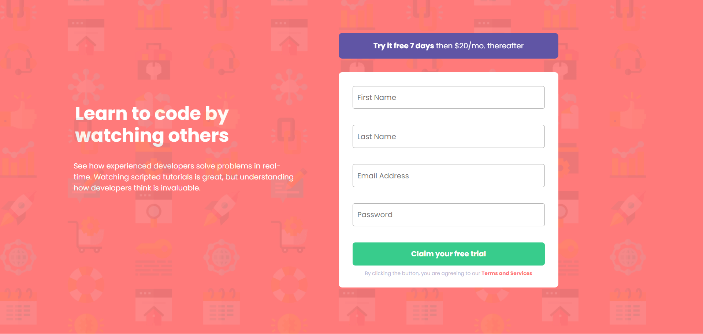
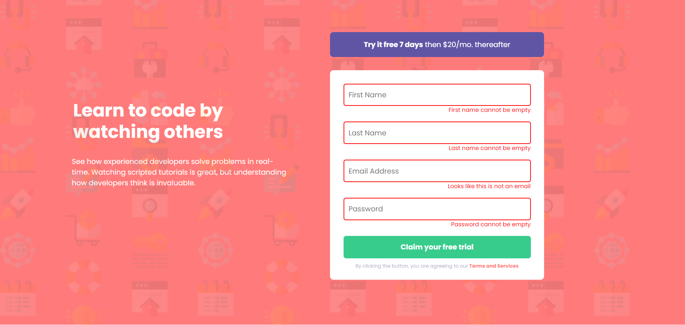

# Depoimentos

## Descrição

Este é um website que apresenta um formulário com autenticação, garantindo que todos os campos sejam preenchidos corretamente.

## Tecnologias Utilizadas

- **HTML**: Estrutura do site.
- **CSS**: Estilo visual.
- **JavaScript**: Verificação de preenchimento de inputs

## Funcionalidades

- Design responsivo e acessível em diferentes dispositivos.

## Visualizações

### Desktop (1440px)

### Desktop error (1440px)

### Mobile (375px)

## Licença

Este projeto é licenciado sob a [MIT License](LICENSE).

## Contato

- **Nome**: William Araújo dos Santos
- **Email**: williamaraujodossantos.com
- **GitHub**: [Meu GitHub](https://github.com/william3002)
